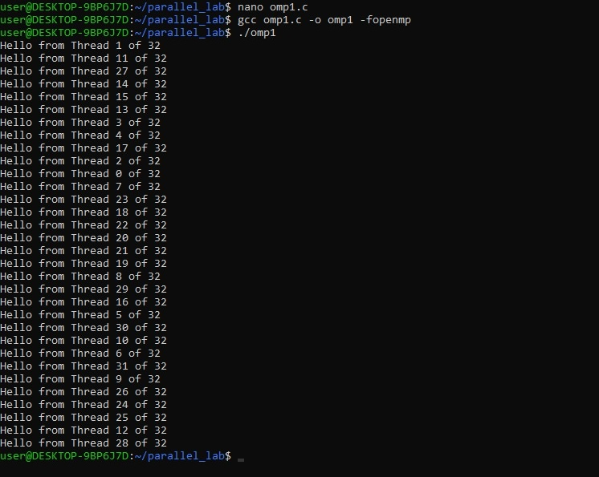
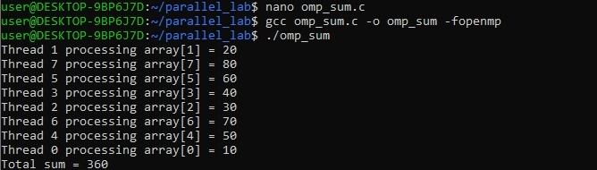
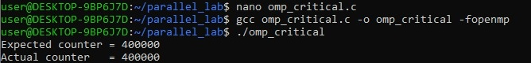
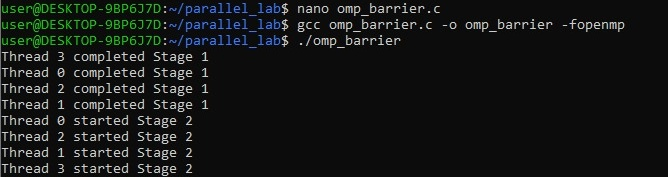
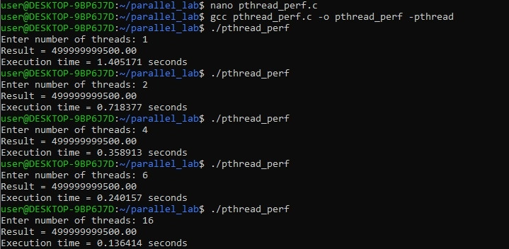
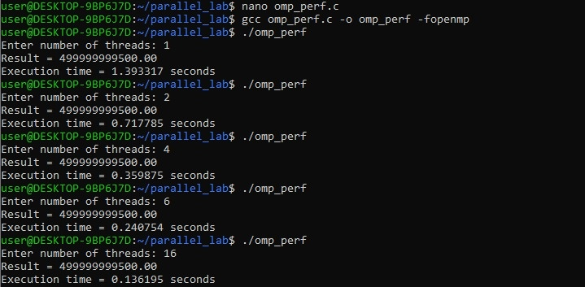
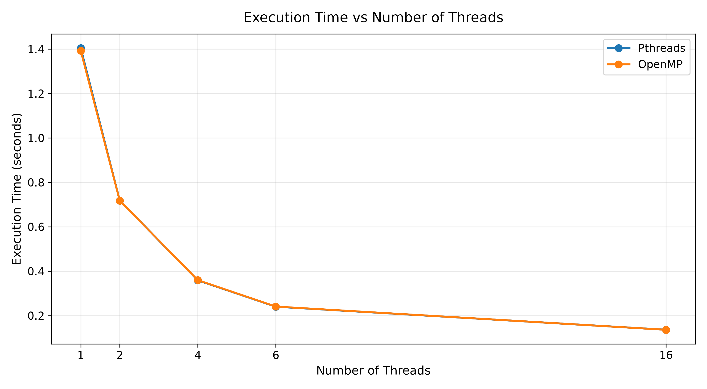
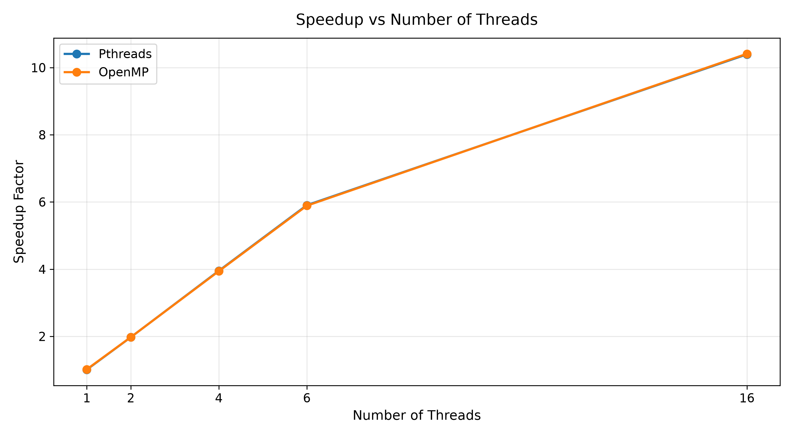
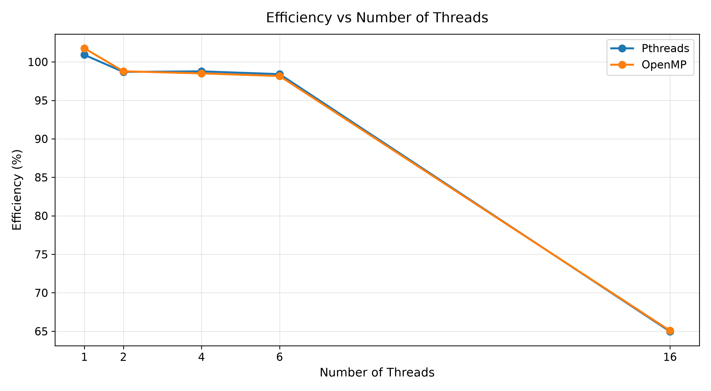

# PGC-02: Multithreaded Programming Using Pthreads and OpenMP

> **Course:** Parallel and GPU Computing (PGC)  
> **Author:** Soumya Surpur  
> **USN:** `01FE24BCI121`  
> **Institution:** KLE Technological University  
> **Module / Repo:** `PGC-02-Multithread-Pthreads-OpenMP`  
> **Laboratory Assignment:** *Develop Multithreaded Programs Using Parallel Programming Libraries to Understand Thread Creation, Management, and Coordination*

---

## Table of Contents

- [1. Aim & Objectives](#1-aim--objectives)
- [2. Theoretical Background](#2-theoretical-background)
  - [Sequential Execution (Single Worker)](#sequential-execution-single-worker)
  - [Multithreaded Parallel Execution (Multiple Workers)](#multithreaded-parallel-execution-multiple-workers)
- [3. Software Environment & System Setup](#3-software-environment--system-setup)
- [4. Part A — POSIX Threads (Pthreads)](#4-part-a--posix-threads-pthreads)
  - [Step 1: Single Thread Creation (`thread1.c`)](#step-1-single-thread-creation-thread1c)
  - [Step 2: Spawning Multiple Threads (`thread2.c`)](#step-2-spawning-multiple-threads-thread2c)
  - [Step 3: Work Distribution & Array Chunking (`thread_sum.c`)](#step-3-work-distribution--array-chunking-thread_sumc)
  - [Step 4: Concurrency Hazards & Race Condition (`race.c`)](#step-4-concurrency-hazards--race-condition-racec)
  - [Step 5: Mutual Exclusion Using Mutex (`mutex.c`)](#step-5-mutual-exclusion-using-mutex-mutexc)
- [5. Part B — OpenMP Compiler Directives](#5-part-b--openmp-compiler-directives)
  - [Step 6: OpenMP Parallel Region & Thread Identification (`omp1.c`)](#step-6-openmp-parallel-region--thread-identification-omp1c)
  - [Step 7: Work-Sharing Loops & Reduction (`omp_sum.c`)](#step-7-work-sharing-loops--reduction-omp_sumc)
  - [Step 8: OpenMP Data Hazards & Race Condition (`omp_race.c`)](#step-8-openmp-data-hazards--race-condition-omp_racec)
  - [Step 9: OpenMP Critical Section Synchronization (`omp_critical.c`)](#step-9-openmp-critical-section-synchronization-omp_criticalc)
  - [Step 10: Phased Barrier Coordination (`omp_barrier.c`)](#step-10-phased-barrier-coordination-omp_barrierc)
- [6. Part C — Performance Analysis & Empirical Scalability](#6-part-c--performance-analysis--empirical-scalability)
  - [Step 11: Single-Threaded Sequential Baseline (`sequential.c`)](#step-11-single-threaded-sequential-baseline-sequentialc)
  - [Step 12 & 13: Pthreads Scalability Benchmarks (`pthread_perf.c`)](#step-12--13-pthreads-scalability-benchmarks-pthread_perfc)
  - [Step 14: OpenMP Scalability Benchmarks (`omp_perf.c`)](#step-14-openmp-scalability-benchmarks-omp_perfc)
  - [Step 15: Measured Execution Time Comparison Table](#step-15-measured-execution-time-comparison-table)
  - [Step 16: Speedup Calculation & Scaling Analysis](#step-16-speedup-calculation--scaling-analysis)
  - [Step 17: Parallel Efficiency Analysis](#step-17-parallel-efficiency-analysis)
  - [Step 18: Architectural Bottlenecks & Hardware Interpretation](#step-18-architectural-bottlenecks--hardware-interpretation)
- [7. Comprehensive Comparison: Pthreads vs. OpenMP](#7-comprehensive-comparison-pthreads-vs-openmp)
- [8. Terminology Glossary](#8-terminology-glossary)
- [9. Repository File Structure](#9-repository-file-structure)

---

## 1. Aim & Objectives

To develop, compile, verify, and benchmark multithreaded programs using **POSIX Threads (Pthreads)** and **OpenMP (Open Multi-Processing)** shared-memory APIs to understand:

1. **Thread Creation and Management:** Spawning, parameter passing, and joining worker threads.
2. **Work Distribution:** Chunking continuous data structures across concurrent workers.
3. **Data Hazards (Race Conditions):** Analyzing non-deterministic state corruption resulting from unsynchronized concurrent writes.
4. **Synchronization Primitives:** Enforcing atomic mutual exclusion with `pthread_mutex_t` and `#pragma omp critical`.
5. **Thread Coordination:** Phased stage-wise barrier synchronization using `#pragma omp barrier`.
6. **Empirical Scalability:** Measuring execution runtime, calculating speedup, and evaluating parallel efficiency across $1, 2, 4, 6,$ and $16$ threads for a numerical workload of $1,000,000,000$ iterations.

---

## 2. Theoretical Background

A **thread** is an independent execution stream scheduled within the address space of a shared process.

### Sequential Execution (Single Worker)
In a sequential architecture, a solitary core performs tasks monotonically in series:

```text
Sequential Execution (1 Core / Single Worker):
Main Thread ─── Task 1 ─── Task 2 ─── Task 3 ─── Task 4 ─── Finish
```

### Multithreaded Parallel Execution (Multiple Workers)
In a multithreaded architecture, the global workload is partitioned into independent chunks executed simultaneously across multi-core CPUs:

```text
Multithreaded Parallel Architecture:
                ┌─── Thread 1 ─── Chunk 1 ───┐
                ├─── Thread 2 ─── Chunk 2 ───┤
Master Spawn ───┼─── Thread 3 ─── Chunk 3 ───┼─── Join & Reduction ─── Aggregated Result
                └─── Thread 4 ─── Chunk 4 ───┘
```

---

## 3. Software Environment & System Setup

| Component | Specification |
| :--- | :--- |
| **Operating System** | Windows 11 with WSL (Windows Subsystem for Linux - Ubuntu) |
| **Terminal Host** | `user@DESKTOP-9BP6J7D:~/parallel_lab$` |
| **Compiler** | GCC 15.2.0 (`gcc (Ubuntu 15.2.0-16ubuntu1) 15.2.0`) |
| **Compilation Flags** | `-pthread` (POSIX Threads), `-fopenmp` (OpenMP), `-O2` (Optimization) |
| **Parallel Hardware Capacity** | **32 Logical Threads** detected & utilized |

### System & Environment Verification
```bash
wsl
mkdir -p ~/parallel_lab && cd ~/parallel_lab
gcc --version
gcc -fopenmp --version
```


---

## 4. Part A — POSIX Threads (Pthreads)

Pthreads is an explicit, low-level C API providing deterministic control over individual thread lifecycle events via `pthread_create()`, `pthread_join()`, and mutex primitives.

---

### Step 1: Single Thread Creation (`thread1.c`)

* **Concept:** Spawns a secondary worker thread executing `thread_function` concurrently while the main thread waits for completion using `pthread_join()`.
* **Source File:** [`thread1.c`](./thread1.c)
* **Compile & Run:**
  ```bash
  gcc thread1.c -o thread1 -pthread
  ./thread1
  ```


---

### Step 2: Spawning Multiple Threads (`thread2.c`)

* **Concept:** Spawns 4 concurrent worker threads inside a loop, passing each thread its unique numeric rank identifier via pointer arguments.
* **Source File:** [`thread2.c`](./thread2.c)
* **Compile & Run:**
  ```bash
  gcc thread2.c -o thread2 -pthread
  ./thread2
  ```
* **Concurrency Insight:** The order of printed messages (`1 -> 3 -> 2 -> 4`) is non-deterministic because thread scheduling is dynamically arbitrated by the operating system kernel.


---

### Step 3: Work Distribution & Array Chunking (`thread_sum.c`)

* **Concept:** An 8-element array `[10, 20, 30, 40, 50, 60, 70, 80]` is partitioned into four contiguous 2-element sub-ranges. Each thread calculates its local partial sum, and the main thread aggregates the final sum.
* **Source File:** [`thread_sum.c`](./thread_sum.c)
* **Compile & Run:**
  ```bash
  gcc thread_sum.c -o thread_sum -pthread
  ./thread_sum
  ```

* **Mathematical Invariant Check:**
  $$\text{Total} = 30 + 70 + 110 + 150 = 360$$


---

### Step 4: Concurrency Hazards & Race Condition (`race.c`)

* **Concept:** Four threads concurrently increment a shared global integer variable `counter` $100,000$ times each without synchronization.
* **Source File:** [`race.c`](./race.c)
* **Compile & Run:**
  ```bash
  gcc race.c -o race -pthread
  ./race
  ```

* **Root Cause Analysis:**
  The C statement `counter++` is not atomic. At the assembly level, it requires three separate instructions:
  1. `MOV EAX, [counter]` (Fetch from RAM to CPU register)
  2. `ADD EAX, 1` (Increment register value)
  3. `MOV [counter], EAX` (Write back to RAM)

  When multiple threads interleave these operations simultaneously, writes overwrite each other. In this run, **262,410 updates were lost** (a massive $65.6\%$ data loss rate).


---

### Step 5: Mutual Exclusion Using Mutex (`mutex.c`)

* **Concept:** Enforces atomic updates to the shared variable using a POSIX mutual exclusion lock (`pthread_mutex_t`).
* **Source File:** [`mutex.c`](./mutex.c)
* **Compile & Run:**
  ```bash
  gcc mutex.c -o mutex -pthread
  ./mutex
  ```
* **Protection Mechanism:**
  ```c
  pthread_mutex_lock(&lock);
  counter++;
  pthread_mutex_unlock(&lock);
  ```
  `pthread_mutex_lock()` guarantees that exactly one thread enters the critical section at any given time, restoring 100% data integrity with **zero lost updates**.


---

## 5. Part B — OpenMP Compiler Directives

OpenMP is a high-level, directive-driven standard that manages thread pooling, loop scheduling, and synchronization transparently via compiler `#pragma omp` directives.

---

### Step 6: OpenMP Parallel Region & Thread Identification (`omp1.c`)

* **Concept:** Creates a team of parallel threads using `#pragma omp parallel` and queries individual thread rank and team size via `omp_get_thread_num()` and `omp_get_num_threads()`.
* **Source File:** [`omp1.c`](./omp1.c)
* **Compile & Run:**
  ```bash
  gcc omp1.c -o omp1 -fopenmp
  ./omp1
  ```



---

### Step 7: Work-Sharing Loops & Reduction (`omp_sum.c`)

* **Concept:** Distributes loop iterations across threads using `#pragma omp parallel for` and computes the array sum safely without race conditions using the `reduction(+:total_sum)` clause.
* **Source File:** [`omp_sum.c`](./omp_sum.c)
* **Compile & Run:**
  ```bash
  gcc omp_sum.c -o omp_sum -fopenmp
  ./omp_sum
  ```

* **Mechanism:** OpenMP maintains private accumulator registers for each thread and combines partial sums into `total_sum` upon loop completion.



---

### Step 8: OpenMP Data Hazards & Race Condition (`omp_race.c`)

* **Concept:** Demonstrates that OpenMP parallel loops sharing an unsynchronized accumulator produce severe race conditions.
* **Source File:** [`omp_race.c`](./omp_race.c)
* **Compile & Run:**
  ```bash
  gcc omp_race.c -o omp_race -fopenmp
  ./omp_race
  ```

* **Outcome:** Without explicit locking, **299,825 updates were dropped** out of 400,000 ($74.96\%$ data corruption).


---

### Step 9: OpenMP Critical Section Synchronization (`omp_critical.c`)

* **Concept:** Restores synchronization using `#pragma omp critical`, which directs the compiler to serialize access to the enclosed block.
* **Source File:** [`omp_critical.c`](./omp_critical.c)
* **Compile & Run:**
  ```bash
  gcc omp_critical.c -o omp_critical -fopenmp
  ./omp_critical
  ```

* **Outcome:** Exactly 400,000 is produced with full correctness.



---

### Step 10: Phased Barrier Coordination (`omp_barrier.c`)

* **Concept:** Coordinates threads across multi-stage execution pipelines using `#pragma omp barrier`. All threads must finish Stage 1 before any thread is permitted to begin Stage 2.
* **Source File:** [`omp_barrier.c`](./omp_barrier.c)
* **Compile & Run:**
  ```bash
  gcc omp_barrier.c -o omp_barrier -fopenmp
  ./omp_barrier
  ```
* **Observation:** Notice the complete temporal separation: every single thread finishes Stage 1 before any thread is allowed to start Stage 2.



---

## 6. Part C — Performance Analysis & Empirical Scalability

To evaluate real-world parallel scalability, a compute-intensive numerical summation workload over **$N = 1,000,000,000$ iterations ($10^9$)** was evaluated across Sequential, Pthreads, and OpenMP implementations:

$$\text{Mathematical Invariant: } \sum_{i=0}^{N-1} (i \times 10^{-6}) = \mathbf{499999999500.00}$$

---

### Step 11: Single-Threaded Sequential Baseline (`sequential.c`)

* **Source File:** [`sequential.c`](./sequential.c)
* **Compile & Run:**
  ```bash
  gcc sequential.c -o sequential_program
  ./sequential_program
  ```

* **Baseline Reference Runtime ($T_{\text{seq}}$):** **`1.418018 seconds`**


---

### Step 12 & 13: Pthreads Scalability Benchmarks (`pthread_perf.c`)

* **Source File:** [`pthread_perf.c`](./pthread_perf.c)
* **Compile & Run:**
  ```bash
  gcc pthread_perf.c -o pthread_perf -pthread
  ./pthread_perf
  ```



---

### Step 14: OpenMP Scalability Benchmarks (`omp_perf.c`)

* **Source File:** [`omp_perf.c`](./omp_perf.c)
* **Compile & Run:**
  ```bash
  gcc omp_perf.c -o omp_perf -fopenmp
  ./omp_perf
  ```



---

### Step 15: Measured Execution Time Comparison Table

| Thread Count ($P$) | Sequential Baseline | Pthreads Execution Time | OpenMP Execution Time | Time Reduction vs Sequential |
| :---: | :---: | :---: | :---: | :---: |
| **1 Thread** | 1.418018 s | **1.405171 s** | **1.393317 s** | ~1.7% |
| **2 Threads** | — | **0.718377 s** | **0.717785 s** | ~49.4% |
| **4 Threads** | — | **0.358913 s** | **0.359875 s** | ~74.7% |
| **6 Threads** | — | **0.240157 s** | **0.240754 s** | ~83.1% |
| **16 Threads** | — | **0.136414 s** | **0.136195 s** | **~90.4%** |



---

### Step 16: Speedup Calculation & Scaling Analysis

$$\text{Speedup } (S) = \frac{T_{\text{sequential}}}{T_{\text{parallel}}}$$

| Threads ($P$) | Pthreads Speedup | OpenMP Speedup | Scaling Assessment |
| :---: | :---: | :---: | :--- |
| **1 Thread** | **1.009×** | **1.018×** | Single-core baseline |
| **2 Threads** | **1.974×** | **1.976×** | Near-linear dual-core speedup (~2×) |
| **4 Threads** | **3.951×** | **3.940×** | Exceptional quad-core speedup (~4×) |
| **6 Threads** | **5.905×** | **5.890×** | Near-perfect physical core scaling (~6×) |
| **16 Threads** | **10.395×** | **10.412×** | Peak parallel throughput (>10× speedup) |



---

### Step 17: Parallel Efficiency Analysis

$$\text{Efficiency } (E) = \frac{\text{Speedup}}{P} \times 100\% = \frac{T_{\text{sequential}}}{P \times T_{\text{parallel}}} \times 100\%$$

| Threads ($P$) | Pthreads Efficiency | OpenMP Efficiency | Operating State |
| :---: | :---: | :---: | :--- |
| **1 Thread** | **100.91%** | **101.77%** | Single thread baseline |
| **2 Threads** | **98.70%** | **98.78%** | Negligible overhead (~99% efficient) |
| **4 Threads** | **98.77%** | **98.51%** | Optimal multicore scaling (~99% efficient) |
| **6 Threads** | **98.41%** | **98.16%** | High sustained core utilization (~98% efficient) |
| **16 Threads** | **64.97%** | **65.07%** | Hyper-threading & memory bandwidth bottleneck |



---

### Step 18: Architectural Bottlenecks & Hardware Interpretation

#### Why does 16 threads achieve ~10.4× speedup instead of 16×?
While theoretical linear scaling would suggest $1.418\text{ s} / 16 \approx 0.088\text{ s}$, the measured execution was $0.136\text{ s}$ ($10.41\times$ speedup, $65.07\%$ efficiency). This is governed by real-world physical computer architecture constraints:

1. **Memory Bandwidth & Bus Saturation:**
   The summation workload constantly streams through data. When 16 threads concurrently access memory, they saturate L3 cache lines and compete for DDR memory bus channels, causing memory stalls.
2. **Simultaneous Multithreading (SMT / Hyper-Threading):**
   Physical cores contain dedicated hardware execution pipelines (ALUs, FPUs). In hyper-threaded configurations, two logical threads share the same physical execution pipeline. Consequently, SMT provides roughly $20\text{--}35\%$ additional throughput per core rather than doubling it.
3. **OS Context Switching & Kernel Scheduling:**
   Coordinating and synchronizing 16 threads introduces kernel-level context switching, cache invalidation, and thread joining overhead as formulated by **Amdahl's Law**.

---

## 7. Comprehensive Comparison: Pthreads vs. OpenMP

| Feature | POSIX Threads (Pthreads) | OpenMP |
| :--- | :--- | :--- |
| **Programming Paradigm** | Explicit, library-based API | High-level, compiler directive-based (`#pragma`) |
| **Thread Creation** | Manual explicit spawning (`pthread_create`) | Automated thread pooling (`#pragma omp parallel`) |
| **Thread Lifecycle** | Programmer must call `pthread_join` | Automatic team barrier and join at block end |
| **Work Partitioning** | Manual index and chunk boundary arithmetic | Automatic iteration scheduling (`omp parallel for`) |
| **Synchronization** | Explicit mutex locks (`pthread_mutex_lock/unlock`) | Directive-based critical blocks (`#pragma omp critical`) |
| **Barrier Coordination** | Manual barrier initialization (`pthread_barrier_t`) | Built-in single directive (`#pragma omp barrier`) |
| **Reduction Support** | Manual per-thread arrays and manual reduction | Native clause (`reduction(+:var)`) |
| **Code Footprint** | Verbose (~60–90 lines with structs and pointers) | Compact (~5–10 lines around standard loops) |
| **Control Granularity** | Fine-grained, low-level thread scheduling control | Coarse-grained, compiler-optimized parallelism |

---

## 8. Terminology Glossary

- **Thread:** The smallest sequence of programmed instructions that can be managed independently by an operating system scheduler.
- **Main Thread:** The initial thread created by the OS to execute `main()`.
- **Worker Thread:** An auxiliary thread spawned to perform parallel slices of work.
- **Work Sharing:** Dividing a large computational task into smaller chunks distributed across concurrent threads.
- **Race Condition:** A software defect occurring when concurrent threads read and write shared data without synchronization, leading to unpredictable results.
- **Mutex (Mutual Exclusion):** A lock mechanism ensuring only one thread can access a shared resource or critical section at any given moment.
- **Critical Section:** A block of code accessing shared resources that must not be concurrently executed by multiple threads.
- **Barrier:** A synchronization primitive where all threads must halt until every thread in the team arrives before proceeding.
- **Speedup ($S$):** The ratio of sequential runtime to parallel runtime ($T_{\text{seq}} / T_{\text{par}}$).
- **Parallel Efficiency ($E$):** The percentage of ideal linear acceleration achieved per thread ($S / P \times 100\%$).
- **Amdahl's Law:** A formula predicting the theoretical maximum speedup possible given the proportion of non-parallelizable sequential code.

---

## 9. Repository File Structure

```text
PGC-02-Multithread-Pthreads-OpenMP/
├── README.md                                                 # Laboratory technical report
├── .gitignore                                                # Git ignore file for binaries
├── Multithreaded_Pthreads_OpenMP_Experiment_Final.docx       # Lab experiment manual reference
│
├── thread1.c                                                 # Step 1: Single thread creation and joining
├── thread2.c                                                 # Step 2: Spawning multiple threads (4 threads)
├── thread_sum.c                                              # Step 3: Array chunk partitioning and partial sums
├── race.c                                                    # Step 4: Pthreads race condition demonstration
├── mutex.c                                                   # Step 5: Fixing race condition with pthread_mutex
│
├── omp1.c                                                    # Step 6: OpenMP parallel region and thread IDs
├── omp_sum.c                                                 # Step 7: OpenMP work-sharing loop and reduction
├── omp_race.c                                                # Step 8: OpenMP race condition demonstration
├── omp_critical.c                                            # Step 9: OpenMP critical section mutual exclusion
├── omp_barrier.c                                             # Step 10: OpenMP phased barrier coordination
│
├── sequential.c                                              # Step 11: Single-threaded summation baseline (N=10^9)
├── pthread_perf.c                                            # Step 12 & 13: Pthreads scalability benchmark (1-16T)
├── omp_perf.c                                                # Step 14: OpenMP scalability benchmark (1-16T)
│
└── images/                                                   # Terminal execution outputs & performance charts
    ├── 00_wsl_gcc_environment.jpeg                           # WSL & GCC version check
    ├── 01_pthread_single_thread.jpeg                         # Step 1 terminal output
    ├── 02_pthread_multiple_threads.jpeg                      # Step 2 terminal output
    ├── 03_pthread_work_distribution_sum.jpeg                 # Step 3 terminal output
    ├── 04_pthread_race_condition.jpeg                        # Step 4 terminal output
    ├── 05_pthread_mutex_fixed.jpeg                           # Step 5 terminal output
    ├── 06_omp_parallel_hello_32threads.jpeg                  # Step 6 terminal output (32 threads)
    ├── 07_omp_sum_reduction.jpeg                             # Step 7 terminal output
    ├── 08_omp_race_condition.jpeg                            # Step 8 terminal output
    ├── 09_omp_critical_section.jpeg                          # Step 9 terminal output
    ├── 10_omp_barrier_synchronization.jpeg                   # Step 10 terminal output
    ├── 11_sequential_baseline.jpeg                           # Step 11 terminal output
    ├── 12_pthread_perf_all_threads.jpeg                      # Step 12 & 13 terminal benchmark output
    ├── 13_omp_perf_all_threads.jpeg                          # Step 14 terminal benchmark output
    ├── execution_time_vs_threads.png                         # High-res Execution Time graph
    ├── speedup_vs_threads.png                                # High-res Speedup graph
    └── efficiency_vs_threads.png                             # High-res Efficiency graph
```
